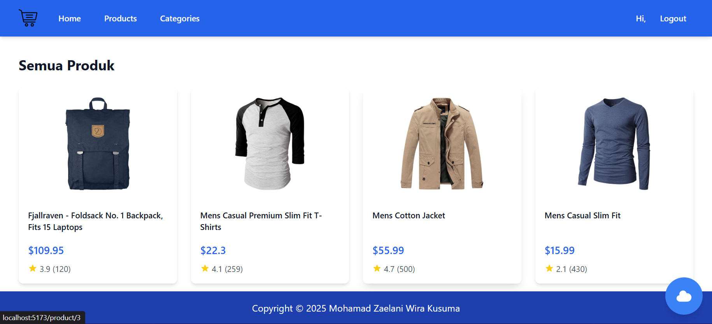
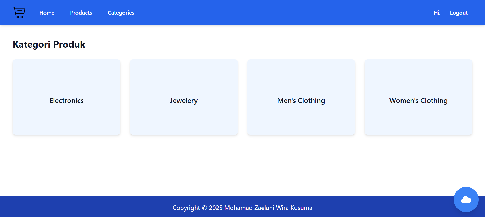
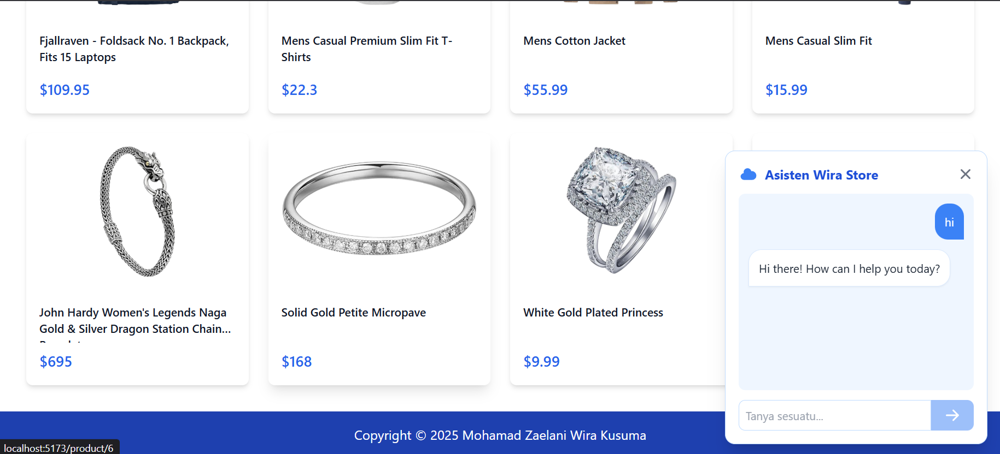
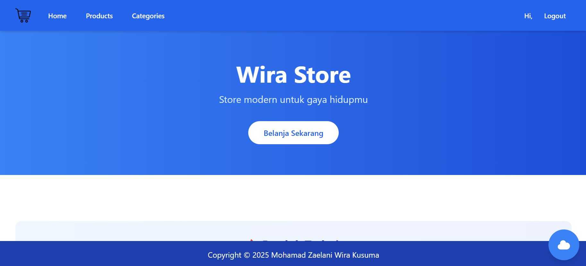

# Wira Store Shirt

Wira Store Shirt is a modern e-commerce web application built with React and Vite, designed for selling shirts and clothing items. The application features user authentication, product management, category browsing, and an AI-powered chatbot for customer support.

## 🚀 Features

- User Authentication (Login/Register)
- Product Management (View, Add, Detail)
- Category Browsing
- AI Chatbot Integration
- Responsive Design

## 🛠️ Technologies Used

### Frontend Framework
- **React 19** - A JavaScript library for building user interfaces
- **Vite 7** - Next generation frontend tooling

### UI & Styling
- **Tailwind CSS** - Utility-first CSS framework
- **Framer Motion** - Production-ready motion library for React
- **Headless UI** - Unstyled, fully accessible UI components
- **Heroicons** - Beautiful hand-crafted SVG icons

### State Management & Routing
- **React Router v7** - Declarative routing for React applications

### API Integration & HTTP Client
- **Axios** - Promise-based HTTP client for the browser
- **FakeStoreAPI** - REST API for e-commerce products and categories

### AI & Backend Integration
- **Google Generative AI** - For powering the chatbot functionality
- **Node.js** - JavaScript runtime for backend services

### Development Tools
- **ESLint** - JavaScript linting utility
- **PostCSS** - Tool for transforming CSS with JavaScript
- **Autoprefixer** - Parse CSS and add vendor prefixes
- **Concurrently** - Run multiple commands concurrently

## 📁 Project Structure

```
src/
├── components/     # Reusable UI components
├── context/        # React context for state management
├── pages/          # Page components
│   ├── Category/   # Category-related pages
│   └── Product/    # Product-related pages
└── App.jsx         # Main application component
```

## 🎯 Getting Started

1. Clone the repository
2. Install dependencies:
   ```bash
   npm install
   ```
3. Start the development server:
   ```bash
   npm run dev
   ```

## 🌐 FakeStoreAPI Integration

This application integrates with [FakeStoreAPI](https://fakestoreapi.com/) to provide realistic e-commerce data including products, categories, and user information. FakeStoreAPI serves as our primary data source for product listings and category management.

## 📸 Screenshots






## 📄 License

This project is licensed under the MIT License.